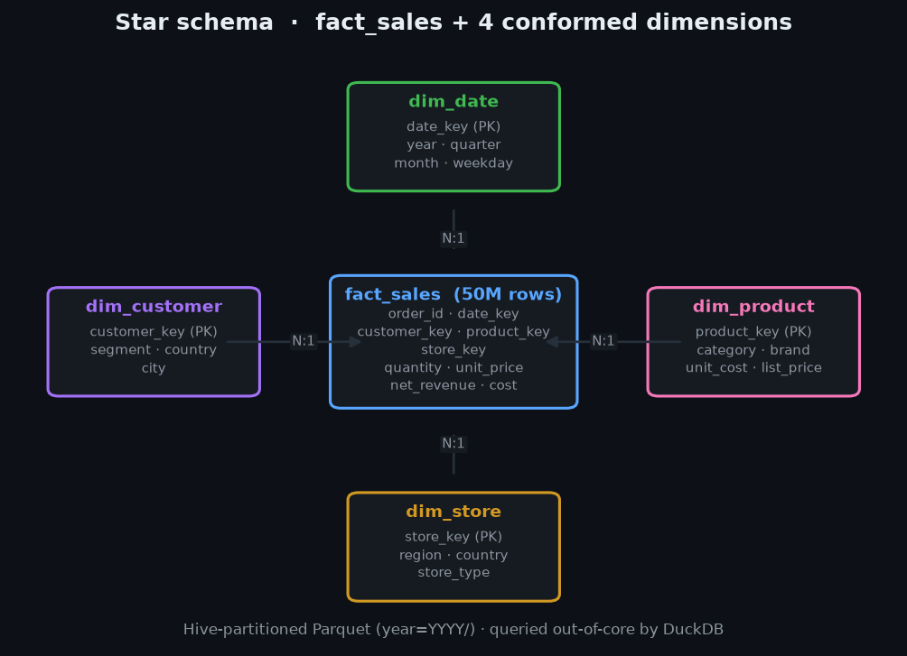
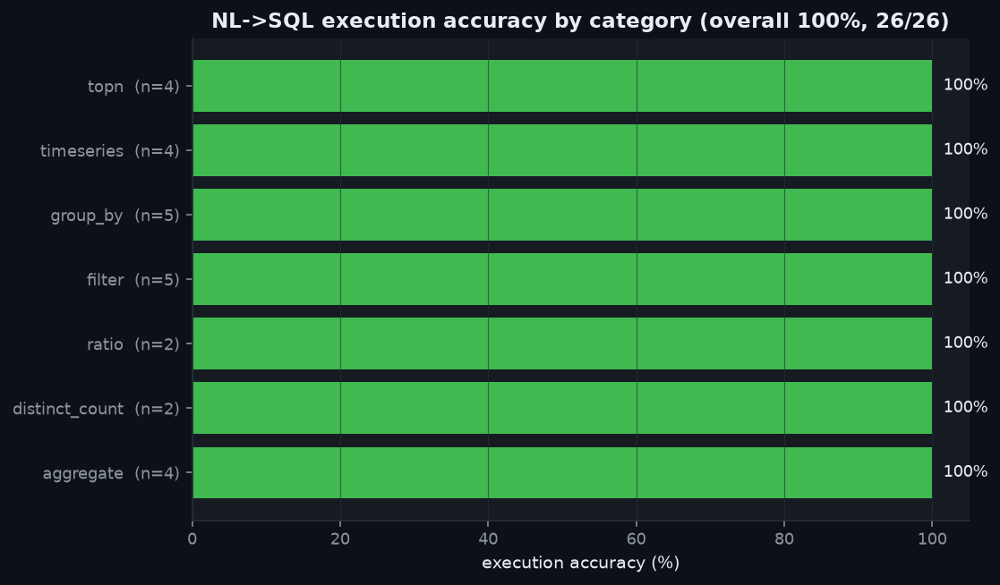
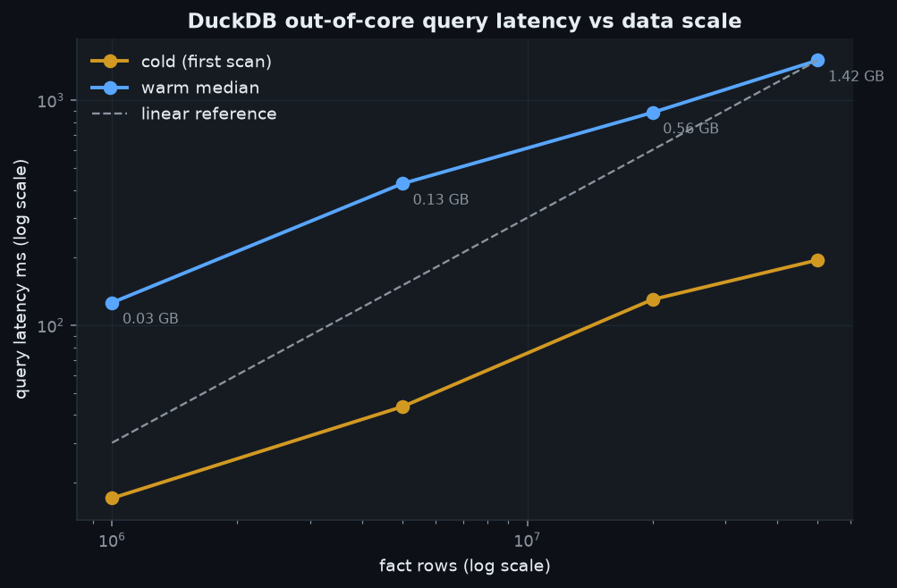
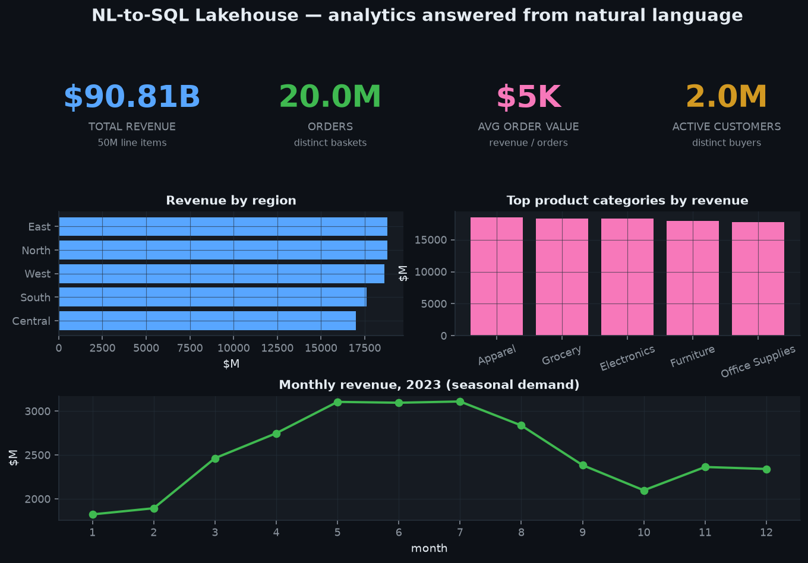

# NL-to-SQL Lakehouse

A DuckDB **lakehouse** over a partitioned-Parquet star schema, with a **semantic
layer** and a deterministic, **offline text-to-SQL** engine. Ask a business
question in English — *"top 5 product categories by revenue"*, *"which region
has the lowest revenue?"*, *"monthly revenue in 2023"* — and the system links
schema entities, compiles validated SQL through the semantic layer, and executes
it out-of-core against 50M fact rows.

No paid LLM, no API keys, fully seeded and reproducible. The NL engine sits
behind an interface so a real LLM can drop in without touching the validation or
execution path.

## Highlights (real measured numbers)

| What | Measured |
|---|---|
| Fact rows built | **50,000,000** (partitioned Parquet) |
| Fact Parquet size | **1.42 GB** (snappy), 28.3 bytes/row |
| Generation throughput | **1.09M rows/s** (45.8 s, memory-bounded, chunked) |
| Full-scan aggregate @ 50M | **196 ms** (cold), 196 ms (warm) |
| Filtered join (year=2023) @ 50M | **196 ms** |
| GROUP BY + join @ 50M | **1.51 s** |
| `COUNT(DISTINCT customer_key)` (2M distinct) @ 50M | **2.31 s** |
| NL→SQL **execution accuracy** | **26/26 = 100%** (per-category all 100%) |
| SQL validated before execution | **26/26** |
| 1B-row extrapolation | **~28 GB** Parquet (measured 28.3 bytes/row) |

> Honest scale: **50M rows actually built and queried**; the generator is
> memory-bounded and parameterized by `--rows` up to 1B (see
> [ARCHITECTURE.md](ARCHITECTURE.md)). 1B numbers are extrapolations from the
> measured per-row footprint, clearly labeled as such.

## Project Document

- Research report: [`PROJECT_DOCUMENT.pdf`](./PROJECT_DOCUMENT.pdf)

## Screenshots

Generated from real pipeline output (`make screenshots`).

### Star schema (data model)


### NL→SQL execution accuracy by category


### Query latency vs data scale (log-log)


### Analytics answered from natural language


## Quickstart

```bash
make setup                 # deps (numpy/pandas/pyarrow/duckdb/polars/matplotlib/pyyaml/pytest)
make data ROWS=50000000    # build the lakehouse -> data/lakehouse (Parquet)
make run                   # run the ~26-question NL->SQL suite vs DuckDB
make test                  # pytest (validator, schema linker, semantic layer, e2e)
make bench                 # latency vs scale (1M / 5M / 20M / 50M)
make screenshots           # render the 4 PNGs into assets/
```

Ask a question programmatically:

```python
from nlsql import SemanticModel, DeterministicNLToSQL, connect

model  = SemanticModel.load()
con    = connect("data/lakehouse")
engine = DeterministicNLToSQL(model, con=con)

res = engine.generate("Top 5 product categories by revenue")
print(res.sql)                    # validated SELECT ... GROUP BY ... ORDER BY ... LIMIT 5
print(con.execute(res.sql).fetchall())
```

## How it works

```
NL question
   │
   ▼  schema linking  (synonyms → metrics / dimensions / filter values)
LinkResult ─────────────┐
   │  intent/slots       │  (top-N, order direction, limit, year)
   ▼                     │
Query (semantic IR)  ◄───┘   metrics=[...] dims=[...] filters=[...] order/limit
   │
   ▼  semantic layer  (auto-resolves fact→dim joins from the star schema)
SQL string
   │
   ▼  validator  (SELECT-only · no DDL/DML · known columns · live EXPLAIN bind)
validated SQL
   │
   ▼  DuckDB  (out-of-core scan over partitioned Parquet)
answer
```

- **Star-schema lakehouse** — `fact_sales` (50M rows) + `dim_customer`,
  `dim_product`, `dim_store`, `dim_date`. Written to Hive-partitioned Parquet
  (`year=YYYY/`), one file per partition, and queried directly (no load step).
- **Semantic layer** ([`semantic_model.yaml`](src/nlsql/semantic_model.yaml)) —
  business metrics (`revenue`, `gross_margin`, `aov`, `active_customers`, …) and
  dimensions mapped to SQL. Joins are resolved automatically: a metric on the
  fact + a dimension on `dim_store` produces the `store_key` join for you.
- **NL-to-SQL engine** — deterministic schema-linking + intent/slot parser
  (`entity / metric / timegrain / filter` extraction) behind the
  `NLToSQLEngine` interface. `LLMNLToSQL` marks the drop-in seam for a real LLM;
  it would reuse the identical validator + execution path.
- **SQL validation** — every statement is checked for shape (single, read-only),
  blocked verbs (`DROP/DELETE/UPDATE/INSERT/ALTER/CREATE/COPY/PRAGMA/ATTACH/…`,
  including CTE-smuggled mutations), column existence against the model catalog,
  and an optional live DuckDB `EXPLAIN` bind — **before** it touches data.

## Evaluation

`make run` generates SQL for ~26 gold NL questions across 7 categories
(`aggregate`, `distinct_count`, `ratio`, `filter`, `group_by`, `timeseries`,
`topn`), validates each, executes it, and compares the result set to
independently hand-written **gold SQL** (order-insensitive, rounded). Outputs:

- `benchmarks/suite_summary.json` — overall + per-category accuracy
- `benchmarks/accuracy_by_category.csv`
- `benchmarks/suite_results.csv` — per-question SQL, answer, exec ms

**Result: 26/26 = 100% execution accuracy, 26/26 validated.**

## Benchmarks

Query latency across scales (`benchmarks/scaling_results.csv`), DuckDB scanning
Parquet out-of-core, 4 threads:

| rows | Parquet | cold scan | full-scan SUM | filter+join | GROUP BY+join | COUNT DISTINCT |
|---:|---:|---:|---:|---:|---:|---:|
| 1M  | 0.03 GB | 17 ms | 24 ms | 24 ms | 126 ms | 143 ms |
| 5M  | 0.13 GB | 44 ms | 49 ms | 64 ms | 427 ms | 711 ms |
| 20M | 0.56 GB | 130 ms | 131 ms | 112 ms | 946 ms | 883 ms |
| 50M | 1.42 GB | 195 ms | 196 ms | 196 ms | 1507 ms | 2307 ms |

See [ARCHITECTURE.md](ARCHITECTURE.md) for design decisions, the file-count vs
latency finding, and the path to 1B rows.

## Layout

```
06-nl-to-sql-lakehouse/
├── src/nlsql/
│   ├── semantic_model.yaml   # the semantic layer (metrics + dimensions -> SQL)
│   ├── semantic.py           # SemanticModel: Query IR -> SQL, auto-joins
│   ├── schema_linker.py      # NL phrases -> entities (synonyms, filters, grain)
│   ├── nl2sql.py             # NLToSQLEngine interface + DeterministicNLToSQL + LLM seam
│   ├── validator.py          # SQL guardrail (shape/verbs/columns/live-bind)
│   ├── generator.py          # memory-bounded star-schema Parquet generator
│   ├── lakehouse.py          # DuckDB connection + in-memory test fixture
│   ├── eval_suite.py         # ~26 gold NL questions + gold SQL + result matcher
│   └── domains.py, viztheme.py
├── scripts/                  # generate_data / run_suite / run_benchmark / make_screenshots
├── tests/                    # pytest: validator, schema linker, semantic layer, e2e
├── benchmarks/               # CSV/JSON results (committed)
└── assets/                   # 4 generated PNGs (committed)
```

## Reproducibility
Everything is seeded (`GenSpec.seed`, default 7). Same command → same lakehouse →
same numbers. Offline: no network, no paid API.
